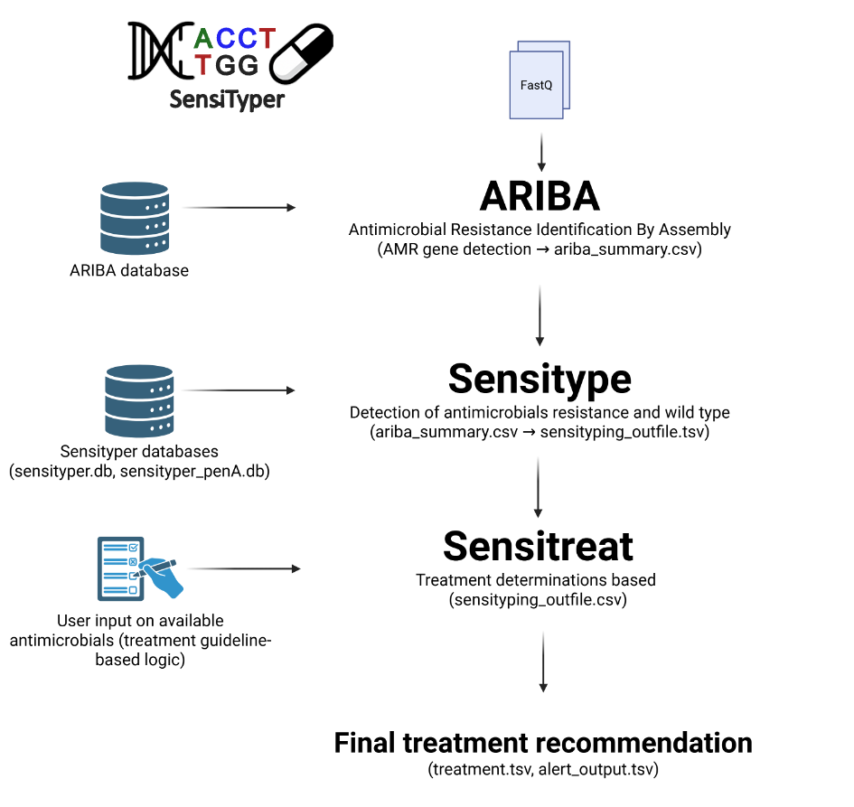

# SensiTyper - Genomic Antimicrobial Susceptibility Prediction and Treatment Recommendation for *Neisseria gonorrhoeae*

[](https://www.python.org/downloads/)
[](LICENSE)

## Overview

SensiTyper is a genomic antimicrobial susceptibility typing pipeline for *Neisseria gonorrhoeae*. It predicts antibiotic resistance profiles from whole-genome sequencing data and provides evidence-based treatment recommendations.

### Key Features

- **Genomic resistance profiling** - Identifies resistance-conferring mutations in 7 antibiotics
- **Treatment recommendations** - Assigns regimens based on current clinical guidelines
- **Interactive HTML reports** - Sortable, searchable tables for easy investigation of results
- **XDR detection** - Flags extensively drug-resistant (XDR) isolates for clinical review
- **Modular workflow** - Run complete pipeline or individual steps

### Supported Antibiotics

- **Ceftriaxone** - First-line injectable cephalosporin
- **Azithromycin** - First-line macrolide (dual therapy)
- **Ciprofloxacin** - Fluoroquinolone (restricted use)
- **Spectinomycin** - Alternative injectable (limited pharyngeal efficacy)
- **Penicillin** - Historical β-lactam
- **Tetracycline** - Historical broad-spectrum
- **Zoliflodacin** - Investigational oral spiropyrimidinetrione

### Pipeline Overview

SensiTyper reads the summary output obtained from ARIBA containing key determinants of antimicrobial resistance, identifies which antibiotics each strain is susceptible to and makes a treatment recommendation. This can be done by running different modules in SensiTyper:

| Module | Aim |
| --- | --- |
| `ariba` | Run ARIBA as a wrapper script |
| `sensitype` | Identify antibiotics each strain is susceptible to |
| `sensitreat` | Perform a treatment recommndation |
| `pipeline` | Chain different modules, e.g. `ariba,sensitype,sensitreat`, `sensitype,sensitreat`, etc. Note that the order must be `ariba < sensitype < sensitreat`, and `sensitreat` needs the output of sensitype to run |

### Workflow:



### Resistance Determinants

The table below lists the genetic markers evaluated by the prediction logic for each antibiotic. Wild-type detection indicates whether a marker is also used to confirm susceptibility.

| Antibiotic | Gene | Wild-type position | Known substitution | Functional effect | Wild-type detection |
|------------|------|-------------------|--------------------|-------------------|---------------------|
| Ceftriaxone | PBP2 | Ala311 | Val | Ceftriaxone resistance | Yes |
|  |  | Val316 | Thr, Pro | Ceftriaxone resistance | Yes |
|  |  | A501 | Pro | Ceftriaxone resistance | Yes |
| Azithromycin | 23S rRNA | A2059 | Guanine | Azithromycin resistance | Yes |
|  | | C2611 | Thymine | Azithromycin resistance | Yes |
|  | MtrD | NA | Semi- and mosaic structure | Azithromycin resistance | No |
|  | MtrC | GC dinucleotide deletion in repeat | NA | Increase azithromycin susceptibility | No |
| Ciprofloxacin | GyrA | Ser91 | Phe | Ciprofloxacin resistance | Yes |
| Spectinomycin | 16S rRNA | C1192 | Thymine | Spectinomycin resistance | Yes |
|  | rpsE (S5) | T22P | NA | Spectinomycin resistance | Yes |
| Zoliflodacin | GyrB | Asp429 | Asn, Ala, Val | Zoliflodacin resistance | Yes |
|  | GyrB | Lys450 | Thr | Zoliflodacin resistance | Yes |

## Installation

### Prerequisites

- **Python 3.6+** (no external Python packages required)
- **[ARIBA](https://github.com/sanger-pathogens/ariba/wiki)** (Antimicrobial Resistance Identification By Assembly)
  ```bash
  conda install -c bioconda ariba
  ```

### Setup

1. **Clone the repository**:
   ```bash
   git clone https://github.com/leosanbu/sensityper.git
   cd sensityper
   ```

2. **Verify database files** are present in `resources/`:
   ```
   resources/
   ├── sensitype.db         # Resistance mutation database
   ├── sensitype.penA.db    # penA mosaic allele database
   └── ariba_db/            # ARIBA reference database

   ```

3. **(Optional) Set environment variables** for custom paths:
   ```bash
   export SENSITYPE_DB=/path/to/sensitype.db
   export SENSITYPE_PENA_DB=/path/to/sensitype.penA.db
   export SENSITYPE_ARIBA_DB=/path/to/ariba_db
   export SENSITYPE_ARIBA_BATCH=/path/to/ariba_batch.py
   export SENSITYPE_RULES_PATH=/path/to/sensiscript_v2.6.py
   ```

   If not set, the scripts will automatically look in the structure of directories available in the repository.

## Usage

### Module: `ariba`

Run ARIBA in batch mode on FASTQ directories.

```bash
python sensityper_v0.6.7.py ariba \
    --input_dirs /data/run1,/data/run2 \
    --output_dir ariba_results \
    --db_path /path/to/ariba_db \
    --threads 8
```

**Arguments**:

- `--input_dirs` - Comma-separated list of directories containing FASTQ files
- `--output_dir` - Output directory for ARIBA results
- `--db_path`- Path to the ARIBA database, by default in `resources/ariba_db`
- `--threads` - Number of CPU threads (default: 1)

**FASTQ Naming**: Fastq files must follow one of these patterns:

- `{sample}_1.fastq.gz` / `{sample}_2.fastq.gz`
- `{sample}_R1.fastq.gz` / `{sample}_R2.fastq.gz`
- `{sample}_R1_001.fastq.gz` / `{sample}_R2_001.fastq.gz`

### Module: `sensitype`

Generate resistance profiles from ARIBA output.

```bash
python sensityper_v0.6.7.py sensitype \
    --input_AMRtable ariba_summary.csv \
    --sensiscript_outfile sensiscript_results.tsv \
    --sensiscript_db resources/sensitype.db \
    --sensiscript_pena resources/sensitype.penA.db \
    --sensiscript_antibiotics ceftriaxone,azithromycin,ciprofloxacin
```

**Arguments**:

- `--input_AMRtable` - ARIBA summary CSV file (required)
- `--sensiscript_outfile` - Output TSV file path (default: `sensiscript_results.tsv`)
- `--sensiscript_db` - Path to sensitype main database of genetic AMR determinants (default: `resources/sensitype.db`)
- `--sensiscript_pena` - Path to a database of penA mosaics (default: `resources/sensitype.penA.db`)
- `--sensiscript_antibiotics` - Comma-separated antibiotic list (default: ceftriaxone,azithromycin,ciprofloxacin,tetracycline,penicillin,zoliflodacin)

**Outputs**:

- `sensiscript_results.tsv` - Resistance mechanisms per isolate
- `sensiscript_results.html` - Interactive table reporting the genetic determinants of AMR and identified wildtype positions found for each isolate

### Module: `sensitreat`

Assign treatment recommendations from resistance profiles.

```bash
python sensityper_v0.6.7.py sensitreat \
    --input_file resistance_profiles.tsv \
    --available_antibiotics ceftriaxone,azithromycin,ciprofloxacin,spectinomycin \
    --sensitreat_order ceftriaxone+azithromycin,ceftriaxone,azithromycin+spectinomycin,ciprofloxacin,spectinomycin \
    --alert_output alert_output.tsv \
    --treatment_output treatment_recommendations.tsv \

```

**Arguments**:

- `--input_file` - Input resistance TSV from sensitype (required)
- `--available_antibiotics` - Comma-separated list of antibiotics available in a specific setting (default: ceftriaxone,azithromycin,ciprofloxacin,spectinomycin,zoliflodacin)
- `--sensitreat_order` - Regimen priority order (default: ceftriaxone+azithromycin,ceftriaxone,azithromycin+spectinomycin,ciprofloxacin,spectinomycin,zoliflodacin). **Important:** azithromycin monotherapy is supported but NOT in the default order; include 'azithromycin' explicitly to enable it
- `--alert_output` - Output TSV for isolates tagged as a clinical alert (default `alert_output.tsv`)
- `--treatment_output` - Output treatment TSV path (default: `treatment_output.tsv`)

**Outputs**:

- `alert_output.tsv` - Isolates with XDR/no treatment options
- `treatment_recommendations.tsv` - Recommended treatment regimens per isolate
- `treatment_recommendations.html` - Combined tabbed HTML with:
  - **Alert Banner** (if XDR isolates present)
  - **Tab 1: Treatment Recommendations** (direct output from the sensitreat module with recommended treatment regimes)
  - **Tab 2: Resistance Profile** (output from the sensitype module)

### Module: `pipeline`

Chain multiple modules together in a single command.

```bash
python sensityper_v0.6.7.py pipeline \
    --modules sensitype,sensitreat \
    --other_arguments '--input_AMRtable ariba_summary.csv --sensiscript_outfile sensiscript_results.tsv'
```

**Arguments**:

- `--modules`: Comma-separated module names (required) (options: `ariba`, `sensitype`, `sensitreat`)
- `--other_arguments` - All module-specific arguments within quotes

### Module: `rename`

Standardize FASTQ file naming across directories.

```bash
python sensityper_v0.6.7.py rename \
    --directories /data/run1,/data/run2 \
    --pre
```

**Arguments**:

- `--directories` - Comma-separated directory list
- `--pre` - Preview mode (dry-run, no actual renaming)

### Complete Pipeline (FASTQ → Treatment Recommendations)

```bash
python sensityper_v0.6.7.py pipeline \
    --modules ariba,sensitype,sensitreat \
    --other_arguments '--input_dirs /data/fastqs \
                       --output_dir ariba_outputdir \
                       --sensiscript_outfile sensiscript_results.tsv \
                       --treatment_output treatment_output.tsv \
                       --threads 8'
```

**Outputs**:

- `ariba_output/` - Folder with ARIBA results for each sample
- `ariba_summary.csv` - ARIBA summary table
- `sensiscript_results.tsv` - Resistance and wildtype determinants detected per isolate (direct output from the `sensitype` module)
- `alert_output.tsv` - XDR/untreatable isolates (direct output from the `sensitreat` module)
- `treatment_output.tsv` - Treatment regimens (direct output from the `sensitreat` module)
- `treatment_output.html` - Interactive combined HTML report (direct output from the `sensitreat` module)

---

## Sensityping metrics — Evaluation of predictions against phenotypic outcomes

**Sensityping metrics** is a companion command-line script for evaluating the performance of genomic AMR predictions against phenotypic (gold-standard) treatment outcomes.

It complements the SensiTyper pipeline by providing rigorous, reproducible performance metrics with confidence intervals, sample size diagnostics, and interactive radar visualisations.

### Two evaluation modes

| Mode | Question answered |
|------|------------------|
| `predicted_vs_treatment` | How accurate is each per-antibiotic prediction? |
| `first_line_vs_treatment` | How well does the treatment cascade perform in practice? |

### Quick example

```bash
# Model-centric evaluation (per antibiotic)
python sensityping_metrics.py \
  -i sensiscript_with_phenotypes.tab \
  -o metrics_predicted.tab \
  -d metrics_predicted_dir \
  --analysis_type predicted_vs_treatment \
  --ci_flag --ci_method hybrid --ci_level 0.95 \
  --n_boot 2000 --seed 1 \
  --ssd_flag --ssd_width 0.05 --ssd_mode observed \
  --radar_flag --radar_metrics PPV,sensitivity,specificity,coverage_fraction

# Clinical cascade evaluation (treatment workflow)
python sensityping_metrics.py \
  -i sensiscript_with_phenotypes.tab \
  -o metrics_firstline.tab \
  -d metrics_firstline_dir \
  --analysis_type first_line_vs_treatment \
  --order 'CRO+AZM,CRO,AZM,AZM+SPC,SPC,ZOL' \
  --id_extraction CRO+AZM,CRO,AZM,AZM+SPC,SPC,ZOL \
  --ci_flag --ci_method hybrid --ci_level 0.95 \
  --n_boot 2000 --seed 1 \
  --ssd_flag --ssd_width 0.05 --ssd_mode observed \
  --radar_flag --radar_metrics PPV,one_minus_FDR,coverage_fraction
```

See the **[Sensityping metrics vignette](metrics.md)** for a full step-by-step tutorial including argument descriptions, expected outputs, and metric interpretation.

## Output Files

### Resistance Profile TSV (`sensiscript_results.tsv`)

Tab-separated file with columns:

- `isolate` - Sample identifier
- `treatment recommendation` - Comma-separated list of suitable antibiotics
- `{antibiotic}_NWT` - Non-wild-type (resistance) markers
- `{antibiotic}_WT` - Wild-type (susceptible) markers

**Example**:

| isolate | treatment recommendation | ceftriaxone_NWT | ceftriaxone_WT | azithromycin_NWT | azithromycin_WT | ciprofloxacin_NWT | ciprofloxacin_WT | tetracycline_NWT | tetracycline_WT | penicillin_NWT | penicillin_WT | zoliflodacin_NWT | zoliflodacin_WT |
|---------|-------------------------|-----------------|----------------|------------------|-----------------|-------------------|------------------|------------------|-----------------|----------------|---------------|------------------|-----------------|
| WHO_A | ceftriaxone,<br>azithromycin,<br>ciprofloxacin,<br>tetracycline,<br>penicillin,<br>zoliflodacin | | penA.A311_WT<br>penA.A501_WT<br>penA.V316_WT | | 23S.A2045_WT<br>23S.C2597_WT<br>mtrC.WT<br>mtrD.WT | | gyrA.D95_WT<br>gyrA.S91_WT<br>parC.D86_WT<br>parC.E91_WT<br>parC.S87_WT | | rpsJ.V57_WT<br>tetM.not_present | | blaTEM.not_present<br>penA.insD345_WT<br>ponA.L421_WT | | gyrB.D429_WT<br>gyrB.K450_WT |
| WHO_Q | (UND) zoliflodacin | penA.60.001<br>penA.A311V<br>penA.V316T | penA.A501_WT | 23S.A2045G[99.9%] | 23S.C2597_WT<br>mtrC.WT<br>mtrD.WT | gyrA.D95_A<br>gyrA.S91F<br>parC.S87R | parC.D86_WT<br>parC.E91_WT | rpsJ.V57M<br>tetM | | penA.60.001<br>ponA.L421P | blaTEM.not_present<br>penA.insD345_WT | | gyrB.D429_WT<br>gyrB.K450_WT |
| WHO_Z | azithromycin,<br>zoliflodacin | penA.64.001<br>penA.A311V<br>penA.V316T | penA.A501_WT | | 23S.A2045_WT<br>23S.C2597_WT<br>mtrC.WT<br>mtrD.WT | gyrA.D95N<br>gyrA.S91F<br>parC.S87R | parC.D86_WT<br>parC.E91_WT | rpsJ.V57M | tetM.not_present | penA.64.001<br>ponA.L421P | blaTEM.not_present<br>penA.insD345_WT | | gyrB.D429_WT<br>gyrB.K450_WT |

### Treatment Output TSV (`treatment_output.tsv`)

Tab-separated file with columns:

- `isolate` - Sample identifier
- `Predicted Profile` - Susceptibility summary (e.g., "ceftriaxone=YES, azithromycin=YES")
- `Recommended Treatment` - Full regimen with dosing (e.g., "Ceftriaxone 1 g IM + Azithromycin 2 g orally")
- `Comment` - Clinical guidance (RECOMMENDATION 1/2/3, warnings)

**Example**:

| isolate | recommended_1 | recommended_2 | Predicted Profile | Recommended Treatment | Comment | ceftriaxone+<br>azithromycin | ceftriaxone | azithromycin | azithromycin+<br>spectinomycin | ciprofloxacin | spectinomycin | zoliflodacin | chosen_regimen |
|---------|---------------|---------------|-------------------|----------------------|---------|------------------------------|-------------|--------------|--------------------------------|---------------|---------------|--------------|----------------|
| WHO-A_S1_L001 | ceftriaxone | azithromycin | ceftriaxone=YES,<br>azithromycin=YES,<br>ciprofloxacin=YES | Ceftriaxone 1 g IM +<br>Azithromycin 2 g orally | Acceptable combination therapy<br>(RECOMMENDATION 2) | YES | NO | NO | NO | NO | NO | NO | ceftriaxone+<br>azithromycin |
| WHO-Q_S9_L001 | None | None | ceftriaxone=NO,<br>azithromycin=NO,<br>ciprofloxacin=NO | XDR_isolate —<br>manual follow-up | Flag for review | NO | NO | NO | NO | NO | NO | NO | None |
| WHO_Z_ERR1448255 | azithromycin | zoliflodacin | ceftriaxone=NO,<br>azithromycin=YES,<br>ciprofloxacin=NO | Zoliflodacin 3 g orally<br>(single dose) | Investigational oral option;<br>phase 3 non-inferior to<br>ceftriaxone+azithromycin for<br>uncomplicated urogenital infection | NO | NO | NO | NO | NO | NO | YES | zoliflodacin |

### Alert Output TSV

Lists isolates requiring clinical review:

- **XDR** - Resistant to ceftriaxone, azithromycin, AND ciprofloxacin
- **None** - No suitable treatment options available

### HTML Report

When running the `sensiscript` alone or `sensityper sensitype` module, results will also be formatted into an HTML file showing the identified resistance and wildtype determinants for each antibiotic under study.

When running `sensityper sensitreat` or the `pipeline` mode including `sensitreat`, a combined HTML report will be produced showing the results of both `sensitype` and `sensitreat` as two tabs:

- **Alert Banner** - Clinical warnings
- **Tab 1: Treatment Recommendations** (direct output from the `sensitreat` module with recommended treatment regimes)
- **Tab 2: Resistance Profile** (outut from the `sensitype` module with detailed resistance and wildtype determinants

## Documentation

- **[*N. gonorrhoeae* WHO reference strains vignette](who-vignette.md)** - Step-by-step tutorial
  - Complete workflow example using *N. gonorrhoeae* WHO reference strains
  - Result interpretation
  - Common issues and solutions

- **[Sensityping metrics vignette](metrics.md)** - Evaluation framework tutorial
  - Model-centric and clinical workflow evaluation
  - Confidence intervals, sample size diagnostics, and radar plots

## Clinical Interpretation

### Treatment Recommendation Categories

**RECOMMENDATION 1** - Guideline-based monotherapy:

- Ceftriaxone 1 g IM
- Used when azithromycin resistance detected

**RECOMMENDATION 2** - Acceptable combination therapy:

- Ceftriaxone 1 g IM + Azithromycin 2 g orally
- Preferred dual therapy for uncomplicated gonorrhea

**RECOMMENDATION 3** - Alternative regimen:

- Spectinomycin 2 g IM + Azithromycin 2 g orally
- Used when ceftriaxone resistance detected
- **Note**: Lower cure rates for pharyngeal infections

**Investigational**:

- Zoliflodacin 3 g orally (single dose)
- Phase 3 trial data shows non-inferiority for urogenital infection

### Important Limitations

- **Genotypic predictions may differ from phenotypic resistance** - Confirmatory culture and antimicrobial susceptibility testing (AST) recommended
- **Spectinomycin** - Avoid for pharyngeal infections when possible
- **Novel mutations** - Flagged with `(WARN:novel_mutation)`, require expert review
- **Clinical context** - Consider patient history, allergies, infection site, and local resistance patterns

## Troubleshooting

### ARIBA Failures

**Symptom**: ARIBA fails for some samples

**Solutions**:
- Check FASTQ file naming (use `rename` module to standardize)
- Increase retry attempts in ariba_batch.py (default: 3)
- Run ARIBA with only one thread

### Treatment Shows "None"

**Symptom**: Treatment recommendation is "None" for an isolate

**Cause**: No suitable treatment available from `--available_antibiotics` list

**Solutions**:
- Check `alert_output.tsv` for XDR status
- Review resistance profile TSV to confirm all antibiotics are resistant
- Consider expanding `--available_antibiotics` if clinically appropriate

### HTML Not Generated

**Symptom**: TSV files created but no HTML output

**Solutions**:
- Check if `--suppress-html` flag was used (pipeline mode suppresses standalone HTML)
- Verify TSV file exists and has valid content (not empty)
- Check console for Python exceptions during HTML generation
- Ensure output directory is writable

## Citation

If you use SensiTyper in your research, please cite:

```
Golparian D, Sánchez-Busó L and Unemo M. Genomic Surveillance Meets Clinical Practice: Rule-Based Individualised Treatment Prediction for Gonorrhoea using SensiTyper (submitted).
```

## Contact

For questions, bug reports, or feature requests:
- Open an issue on GitHub
- Contact leonor.sanchez@fisabio.es or daniel.golparian@regionorebrolan.se

---

**Disclaimer**: This tool is for research and surveillance purposes. Clinical treatment decisions should be made by qualified healthcare professionals considering patient-specific factors, local resistance patterns, and current treatment guidelines. Confirmatory phenotypic testing is recommended when possible.
