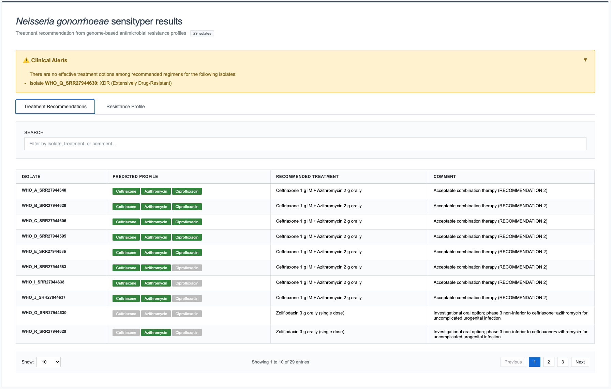
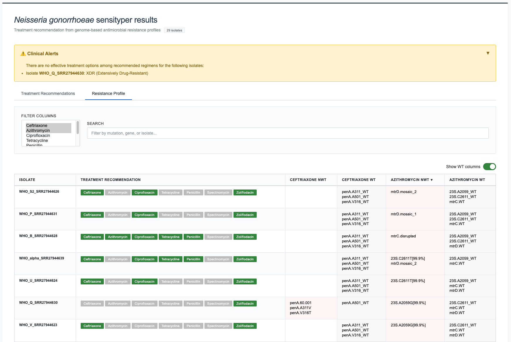
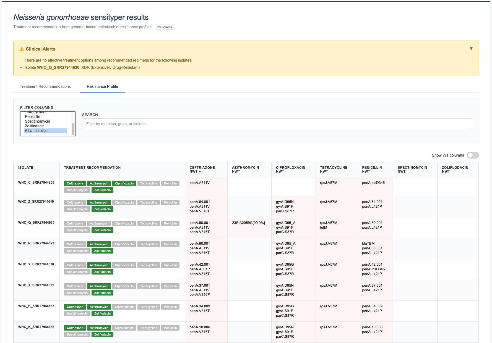

# SensiTyper tutorial - Analysis of *Neisseria gonorrhoeae* WHO reference strains

## Introduction

This tutorial demonstrates a complete SensiTyper workflow using WHO *Neisseria gonorrhoeae* reference strains with known antimicrobial resistance (AMR) profiles.

**Prerequisites**:

- Python 3.6+
- ARIBA installed (`conda install -c bioconda ariba`)
- Sensityping scripts and databases (see README.md for installation)

## Tutorial Dataset

We will use whole-genome sequencing Illumina data produced from 29 [***N. gonorrhoeae* WHO reference strains**](https://doi.org/10.1093/jac/dkae176) representing diverse resistance profiles. FASTQ files for these strains can be obtained from the European Nucleotide Archive (ENA) study accession [PRJNA1067895](https://www.ebi.ac.uk/ena/browser/view/PRJNA1067895).

Pre-computed outputs from running this tutorial are available in the `examples/` directory:

```
examples/
├── ariba_output/                         # ARIBA results per strain
│   ├── WHO_A_SRR27944640_ARIBA/
│   │   └── report_complete.tsv
│   ├── WHO_B_SRR27944628_ARIBA/
│   │   └── report_complete.tsv
│   ├── ... (one folder per strain)
│   └── ariba_summary.csv                 # ARIBA summary — input for sensitype
└── sensityper_output/                    # SensiTyper results
    ├── WHO_strains_sensitype.tsv         # Resistance profiles
    ├── WHO_strains_sensitreat.tsv        # Treatment recommendations
    ├── WHO_strains_sensitreat.html       # Interactive combined HTML report
    └── alert_output.tsv                  # XDR / no-treatment isolates
```

## Step 1: Prepare FASTQ Data

First, download the FASTQ files for all or a subset of the following strains from the ENA [PRJNA1067895](https://www.ebi.ac.uk/ena/browser/view/PRJNA1067895). Here is a table with individual run accessions for each strain:

| Strain | Run accession |
|--------|--------------|
| WHO_A | SRR27944640 |
| WHO_B | SRR27944628 |
| WHO_C | SRR27944606 |
| WHO_D | SRR27944595 |
| WHO_E | SRR27944586 |
| WHO_F | SRR27944585 |
| WHO_G | SRR27944584 |
| WHO_H | SRR27944583 |
| WHO_I | SRR27944638 |
| WHO_J | SRR27944637 |
| WHO_K | SRR27944636 |
| WHO_L | SRR27944635 |
| WHO_M | SRR27944634 |
| WHO_N | SRR27944633 |
| WHO_O | SRR27944632 |
| WHO_P | SRR27944631 |
| WHO_Q | SRR27944630 |
| WHO_R | SRR27944629 |
| WHO_S | SRR27944627 |
| WHO_S2 | SRR27944626 |
| WHO_T | SRR27944625 |
| WHO_U | SRR27944624 |
| WHO_V | SRR27944623 |
| WHO_W | SRR27944622 |
| WHO_X | SRR27944621 |
| WHO_Y | SRR27944620 |
| WHO_Z | SRR27944619 |
| WHO_alpha | SRR27944639 |
| WHO_beta | SRR27944617 |

### File Naming Convention

FASTQ files must follow one of these naming patterns:

```
{sample}_1.fastq.gz / {sample}_2.fastq.gz
{sample}_R1.fastq.gz / {sample}_R2.fastq.gz
{sample}_R1_001.fastq.gz / {sample}_R2_001.fastq.gz
```

### (Optional) Standardize File Naming

If your FASTQ files have inconsistent naming, use the `rename` module:

```bash
# Preview changes (dry-run)
python sensityper_v0.6.7.py rename \
    --directories examples/ \
    --pre

# Execute renaming
python sensityper_v0.6.7.py rename \
    --directories examples/ \
```

## Step 2: Run ARIBA

ARIBA identifies antimicrobial resistance genes and mutations from whole-genome sequencing data.

### Command

```bash
python sensityper_v0.6.7.py ariba \
    --input_dirs /path/to/PRJNA1067895_Illumina \
    --output_dir PRJNA1067895_ARIBA \
    --threads 8
```

**Arguments**:

- `--input_dirs`: Directory containing FASTQ files
- `--output_dir`: Where to save ARIBA results
- `--threads`: CPU cores to use (adjust based on your system)

### Expected Runtime

- **~2-5 minutes per isolate** (depending on CPU)

### Expected Output

Output folders are named `{strain_accession}_ARIBA`. The pre-computed results for this dataset are in `examples/ariba_output/`:

```
PRJNA1067895_ARIBA/
├── WHO_A_SRR27944640_ARIBA/
│   └── report_complete.tsv
├── WHO_B_SRR27944628_ARIBA/
│   └── report_complete.tsv
├── ... (one folder per strain)
└── ariba_summary.csv          ← Main output for next step
```

### Verify Success

Check that `ariba_summary.csv` was created:

```bash
head -n 3 PRJNA1067895_ARIBA/ariba_summary.csv
```

**Expected Output** (truncated):
```
name,penA.cluster,penA.match,penA.assembled,penA.pct_coverage,...
WHO_A_SRR27944640,yes,yes,yes,100,...
WHO_B_SRR27944628,yes,yes,yes,100,...
```

A pre-computed version is available at `examples/ariba_output/ariba_summary.csv`.

## Step 3: Generate Resistance Profiles

The `sensitype` module analyzes ARIBA output to identify genetic determinants of resistance and outputs a list of antibiotics each strain is susceptible to.

### Command

```bash
python sensityper_v0.6.7.py sensitype \
    --input_AMRtable examples/ariba_output/ariba_summary.csv \
    --sensiscript_outfile WHO_strains_sensitype.tsv
```

**Arguments**:

- `--input_AMRtable`: ARIBA summary CSV from Step 2
- `--sensiscript_outfile`: Output file path (TSV format)
- `--antibiotics`: (Optional) Comma-separated list to analyze specific antibiotics (default: all 7)

### Expected Runtime

- **~5-15 seconds** for 29 isolates

### Expected Output Files

1. **WHO_strains_sensitype.tsv** - Tab-separated resistance mechanisms
2. **WHO_strains_sensitype.html** - Interactive HTML table

Pre-computed versions are available at `examples/sensityper_output/`.

### Inspect WHO_strains_sensitype.tsv

```bash
head -n 3 WHO_strains_sensitype.tsv | cut -f1-4
```

**Expected Output** (truncated):
```
isolate                   treatment recommendation  ceftriaxone_NWT  ceftriaxone_WT
WHO_A_SRR27944640         ceftriaxone,azithromycin                   penA.mosaic_WT
WHO_B_SRR27944628         ceftriaxone,azithromycin                   penA.mosaic_WT
```

### Interpreting Results

**Columns**:

- `isolate`: Sample identifier
- `treatment recommendation`: Comma-separated list of suitable antibiotics
- `{antibiotic}_NWT`: **Non-Wild-Type** (resistance mutations, **RED** in HTML)
- `{antibiotic}_WT`: **Wild-Type** (susceptibility markers, **GREY** in HTML)

**Example: WHO_A_SRR27944640**
```
ceftriaxone_NWT: (empty)
ceftriaxone_WT:  penA.A311_WT,penA.V316_WT,penA.A501_WT
azithromycin_NWT: (empty)
azithromycin_WT: 23S.A2045_WT,23S.C2597_WT,mtrC.WT,mtrD.WT
ciprofloxacin_NWT: (empty)
ciprofloxacin_WT: gyrA.D95_WT,gyrA.S91_WT,parC.D86_WT,parC.E91_WT,parC.S87_WT
```

**Interpretation**:

- **Ceftriaxone**: Susceptible (no key *penA* mutations)
- **Azithromycin**: Susceptible (no key *23S rRNA* or *mtrD* mutations)
- **Ciprofloxacin**: Susceptible (no key *gyrA* or *parC* mutations)
- **Treatment**: Suitable for ceftriaxone + azithromycin dual therapy

**Example: WHO_Q_SRR27944630 (XDR)**
```
ceftriaxone_NWT: penA.60.001,penA.A311V,penA.V316T
ceftriaxone_WT: penA.A501_WT
azithromycin_NWT: 23S.A2059G[99.9%]
azithromycin_WT: 23S.C2597_WT,mtrC.WT,mtrD.WT
ciprofloxacin_NWT: gyrA.D95_A,gyrA.S91F,parC.S87R
ciprofloxacin_WT: parC.D86_WT,parC.E91_WT
```

**Interpretation**:

- **Ceftriaxone**: Resistant (mosaic *penA* with key resistance mutations)
- **Azithromycin**: Resistant (23S rRNA mutation at position 2059)
- **Ciprofloxacin**: Resistant (gyrA mutations at codons 91 and 95)
- **Treatment**: XDR - requires alternative regimen or investigational drugs

### Explore WHO_strains_sensitreat.html

Open the HTML file in your web browser:

```bash
open WHO_strains_sensitreat.html  # macOS
xdg-open WHO_strains_sensitreat.html  # Linux
start WHO_strains_sensitreat.html  # Windows
```

**Interactive Features**:

- **Click column headers** to sort (▲/▼ indicators)
- **Search box** for live filtering
- **Antibiotic filter** (multi-select dropdown)
- **Color coding**: Red=resistance (NWT), Blue=susceptible (WT)
- **Pagination** (10/25/50/100/All entries per page)
- **WT columns** to show or hide identified wildtype positions

## Step 4: Assign Treatment Recommendations

The `sensitreat` module assigns evidence-based treatment regimens based on resistance profiles.

### Command

```bash
python sensityper_v0.6.7.py sensitreat \
    --input_file WHO_strains_sensitype.tsv \
    --treatment_output WHO_strains_sensitreat.tsv
```

**Arguments**:

- `--input_file`: Resistance TSV from Step 3
- `--treatment_output`: Output file path for treatment recommendations
- `--available_antibiotics`: (Optional) Limit to available antibiotics (default: all except azithromycin monotherapy)
- `--sensitreat_order`: (Optional) Customize regimen priority order

### Expected Runtime

- **~2-5 seconds** for 29 isolates

### Expected Output Files

1. **alert_output.tsv** - XDR/untreatable isolates flagged for review
2. **WHO_strains_sensitreat.tsv** - Treatment recommendations per isolate
3. **WHO_strains_sensitreat.html** - **Combined tabbed HTML** with both resistance and treatment tables

Pre-computed versions are available in `examples/sensityper_output/`.

### Inspect WHO_strains_sensitreat.tsv

```bash
head -n 3 WHO_strains_sensitreat.tsv | cut -f1,4-6
```

**Expected Output** (truncated):
```
isolate                   Predicted Profile                                    Recommended Treatment                              Comment
WHO_A_SRR27944640         ceftriaxone=YES, azithromycin=YES, ciprofloxacin=YES Ceftriaxone 1 g IM + Azithromycin 2 g orally      Acceptable combination therapy (RECOMMENDATION 2)
WHO_B_SRR27944628         ceftriaxone=YES, azithromycin=YES, ciprofloxacin=YES Ceftriaxone 1 g IM + Azithromycin 2 g orally      Acceptable combination therapy (RECOMMENDATION 2)
```

### Inspect alert_output.tsv

```bash
cat alert_output.tsv
```

**Expected Output** (if XDR isolates present):
```
Alert  isolate           treatment recommendation
XDR WHO_Q_SRR27944630   (UND) zoliflodacin
```

**Alert Types**:

- **XDR**: Extensively Drug-Resistant (resistant to ceftriaxone, azithromycin, AND ciprofloxacin)
- **None**: No suitable treatment available from specified antibiotics

### Interpreting Treatment Recommendations

**Example 1: WHO_A_SRR27944640 (Susceptible)**

```
Predicted Profile:       ceftriaxone=YES, azithromycin=YES, ciprofloxacin=YES, spectinomycin=YES
Recommended Treatment:   Ceftriaxone 1 g IM + Azithromycin 2 g orally
Comment:                 Acceptable combination therapy (RECOMMENDATION 2)
```

**Clinical Interpretation**:

- **Regimen**: Standard dual therapy (first-line)
- **Route**: Ceftriaxone intramuscular (IM), Azithromycin oral
- **Rationale**: Susceptible to both agents, combination prevents resistance development
- **Category**: RECOMMENDATION 2 (preferred dual therapy)

**Example 2: WHO_R_SRR27944629 (Ceftriaxone-Resistant)**

```
Predicted Profile:       ceftriaxone=NO, azithromycin=YES, ciprofloxacin=NO, spectinomycin=YES
Recommended Treatment:   Spectinomycin 2 g IM + Azithromycin 2 g orally
Comment:                 Alternative regimen (RECOMMENDATION 3)
```

**Clinical Interpretation**:

- **Regimen**: Alternative dual therapy (ceftriaxone resistance detected)
- **Route**: Both intramuscular or oral
- **Rationale**: Avoid ceftriaxone due to resistance, use spectinomycin + azithromycin
- **Category**: RECOMMENDATION 3 (alternative regimen)
- **⚠️ Important**: Spectinomycin has lower cure rates for **pharyngeal infections** - avoid when possible

**Example 3: WHO_Q_SRR27944630 (XDR)**

```
Predicted Profile:       ceftriaxone=NO, azithromycin=NO, ciprofloxacin=NO, spectinomycin=YES
Recommended Treatment:   Spectinomycin 2 g IM
Comment:                 Lower cure rates in oropharyngeal infection; avoid for pharyngeal disease when possible (RECOMMENDATION 1)
Alert:                   XDR
```

**Clinical Interpretation**:

- **Regimen**: Spectinomycin monotherapy (only option)
- **Alert**: XDR isolate - flagged for clinical review
- **Action Required**:
  1. Confirm infection site (spectinomycin ineffective for pharyngeal)
  2. Consider investigational drugs (zoliflodacin)
  3. Consult infectious disease specialist
  4. Report to public health authorities
  5. Ensure test of cure after treatment

### Treatment Recommendation Categories

**RECOMMENDATION 1** - Guideline-based monotherapy:

- Ceftriaxone 1 g IM
- Used when: Azithromycin resistance detected OR azithromycin unavailable

**RECOMMENDATION 2** - Acceptable combination therapy:

- Ceftriaxone 1 g IM + Azithromycin 2 g orally
- Used when: Both agents susceptible
- Preferred regimen for uncomplicated gonorrhea

**RECOMMENDATION 3** - Alternative regimen:

- Spectinomycin 2 g IM + Azithromycin 2 g orally
- Used when: Ceftriaxone resistance detected
- ⚠️ Lower cure rates for pharyngeal infections

**Investigational**:

- Zoliflodacin 3 g orally (single dose)
- Phase 3 trial data: non-inferior to ceftriaxone+azithromycin for urogenital infection
- Not yet widely available

## Step 5: Explore Combined HTML Report

The combined HTML report is the primary output for clinical interpretation and surveillance.

### Open WHO_strains_sensitreat.html

```bash
open WHO_strains_sensitreat.html  # macOS
xdg-open WHO_strains_sensitreat.html  # Linux
start WHO_strains_sensitreat.html  # Windows
```

A pre-computed version is available at `examples/sensityper_output/WHO_strains_sensitreat.html`.

### HTML Structure

**Alert Banner** (if applicable):
```
⚠️ Clinical Alerts
• Isolate WHO_Q_SRR27944630: XDR (Extensively Drug-Resistant) - Requires clinical review
```

**Tab Navigation**:
- **Tab 1: Treatment Recommendations** (shown by default)
- **Tab 2: Resistance Profile** (detailed mechanisms)

### Tab 1: Treatment Recommendations

**Columns** (4 total):

1. **Isolate** - Sample identifier
2. **Predicted Profile** - Color-coded susceptibility badges
   - Green badge = YES (susceptible)
   - Gray badge = NO (resistant)
3. **Recommended Treatment** - Full regimen with dosing instructions
4. **Comment** - Clinical guidance and recommendation category

**Interactive Features**:

- **Sort**: Click column headers
- **Search**: Live filtering across all columns
- **Pagination**: 10/25/50/100/All entries per page



### Tab 2: Resistance Profile

**Columns** (varies by antibiotic):

- `isolate`
- `treatment recommendation`
- For each antibiotic: `{antibiotic}_NWT`, `{antibiotic}_WT`

**Interactive Features**:

- **Sort**: Click column headers
- **Search**: Live filtering
- **Antibiotic Filter**: Multi-select dropdown
- **Pagination**: Same as Tab 1



WT columns can also be hidden with the 'Show WT' switch:


## Complete Pipeline (Alternative Approach)

Instead of running modules separately, use the **pipeline** module for end-to-end automation. The pre-computed outputs in `examples/` were generated with this single command:

### Single Command

```bash
python sensityper_v0.6.7.py pipeline \
    --modules ariba,sensitype,sensitreat \
    --other_arguments '--input_dirs /path/to/PRJNA1067895_Illumina \
                       --output_dir PRJNA1067895_ARIBA \
                       --sensiscript_outfile WHO_strains_sensitype.tsv \
                       --treatment_output WHO_strains_sensitreat.tsv'
```

### What Happens

1. **ARIBA module**: Processes FASTQ files → `ariba_output/ariba_summary.csv`
2. **Sensitype module**: Analyzes ARIBA output → `WHO_strains_sensitype.tsv`
3. **Sensitreat module**: Assigns treatments → `WHO_strains_sensitreat.tsv` + `WHO_strains_sensitreat.html`

### Benefits of the `pipeline` mode

- **Single command**: Less manual intervention
- **Optimized HTML**: Only one combined HTML generated (no duplicate standalone HTML)
- **Automatic chaining**: Output of one module feeds into next

### When to Use Separate Modules

- **Re-running analysis**: Already have ARIBA results, only need to update treatment logic
- **Custom antibiotics**: Want to analyze different antibiotic subsets
- **Debugging**: Isolate specific module failures
- **External ARIBA**: Using ARIBA results from another study

## Next Steps

### Using Your Own Data

1. **Prepare FASTQ files**:
   - Ensure paired-end reads (R1/R2)
   - Follow naming convention
   - Place in a single directory

2. **Run pipeline**:
   ```bash
   python sensityper_v0.6.7.py pipeline ariba,sensitype,sensitreat \
       --other_arguments "--input_dirs /path/to/your/fastqs \
                          --output_dir my_analysis \
                          --sensiscript_outfile my_resistance.tsv \
                          --treatment_output my_treatment.tsv \
                          --threads 16"
   ```

3. **Review outputs**:
   - Check `alert_output.tsv` for XDR isolates
   - Open the generated HTML report for interactive results
   - Share HTML with clinical team (self-contained, no external dependencies)

### Customizing treatment recommendations

**Limit to available antibiotics**:
```bash
python sensityper_v0.6.7.py sensitreat \
    --input_file my_resistance.tsv \
    --available_antibiotics ceftriaxone,azithromycin,spectinomycin \
    --treatment_output my_treatment.tsv
```

**Change regimen priority**:
```bash
python sensityper_v0.6.7.py sensitreat \
    --input_file my_resistance.tsv \
    --sensitreat_order ceftriaxone,azithromycin+spectinomycin,spectinomycin \
    --treatment_output my_treatment.tsv
```

### Batch processing multiple studies

```bash
# Process multiple sequencing runs
python sensityper_v0.6.7.py ariba \
    --input_dirs /data/run1,/data/run2,/data/run3 \
    --output_dir batch_ariba \
    --threads 32

# Continue pipeline
python sensityper_v0.6.7.py pipeline sensitype,sensitreat \
    --input_AMRtable batch_ariba/ariba_summary.csv \
    --sensiscript_outfile batch_resistance.tsv \
    --treatment_output batch_treatment.tsv
```

### Clinical Reminder

**This tool is for surveillance and research**. Clinical decisions should consider:
- Patient allergies and contraindications
- Infection site (pharyngeal vs. urogenital)
- Local resistance patterns
- Current treatment guidelines
- Treatment history and previous failures

Always consult infectious disease specialists for:
- XDR isolates
- Treatment failures
- Severe infections (disseminated, PID)
- Immunocompromised patients

## Additional Resources

- **[README.md](index.md)** - Installation and quick start
- **ARIBA documentation** - https://github.com/sanger-pathogens/ariba
- **WHO gonorrhea guidelines** - https://www.who.int/publications/i/item/9789241549691
- **CDC gonorrhea treatment** - https://www.cdc.gov/std/treatment-guidelines/gonorrhea.htm

## Questions or Issues?

- Open an issue on GitHub!

